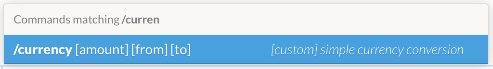

# slack-currency [](https://gemnasium.com/matiassingers/slack-currency)
> slack command for converting currency


## Running locally
```sh
$ git clone git@github.com:matiassingers/slack-currency.git && cd slack-currency
$ npm install
$ npm start
```

Your local copy should now be running at [`localhost:1337`](http://localhost:1337).

## Deploying to Heroku
```sh
$ heroku create
$ git push heroku master
$ heroku open
```

Alternatively, you can deploy your own copy with one click using this button:

[](https://heroku.com/deploy?template=https://github.com/matiassingers/slack-currency)


## Slack setup
1. Create a Slack [incoming WebHook][slack-webhook] integration *(settings aren't important, note the WebHook URL and token)*
2. Create a Slack [slash command][slack-command] integration *(`/currency` is recommended)*
3. Deploy your copy of `slack-currency`, and enter URL endpoint in the Slack [slash command][slack-command]
4. *Optional: Add autocomplete help text to Slack command:*
  


## Settings
The following environment variables needs to be set for the command to work, if you use the Heroku Button above it'll ask for these automatically.

- `SLACK_HOOK_URL` - *Slack [incoming WebHook][slack-webhook] URL*
- `SLACK_TOKEN` - *Additional security step: Slack [slash command][slack-command] token for verification that the request came from your Slack team (not required)*
- `USERNAME` - *Username to use when replying with the conversion result (default: dorrars)*
- `EMOJI` - *Emoji icon to use when replying with the conversion result (default: :moneybag:)*
- `DEFAULT_CURRENCY` - *Default currency to convert to if no second currency is specified (default: DKK)*


## License

MIT © [Matias Singers](http://mts.io)

[slack-webhook]: https://my.slack.com/services/new/incoming-webhook/
[slack-command]: https://my.slack.com/services/new/slash-commands
